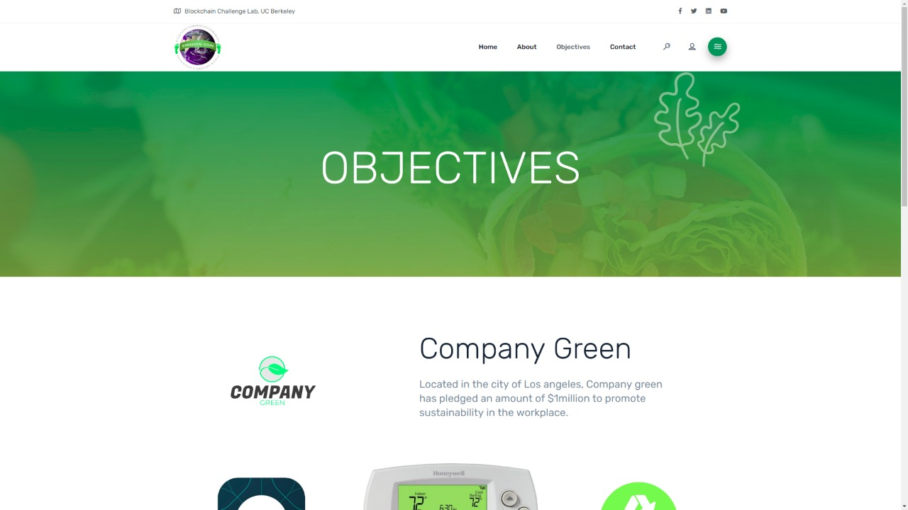
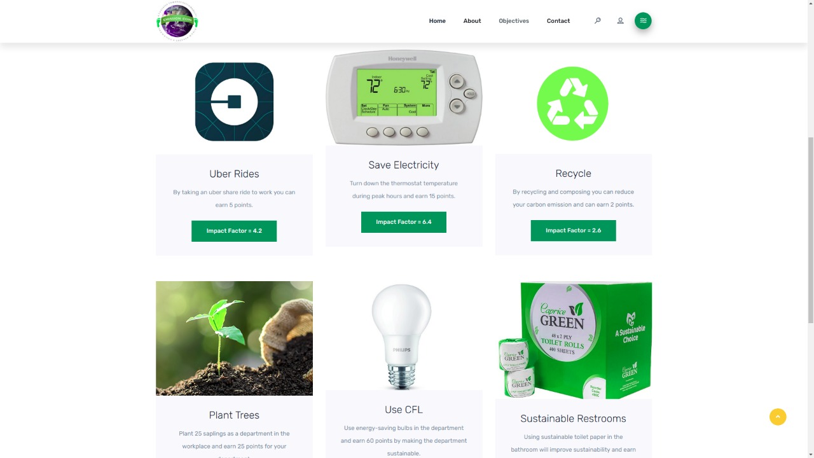
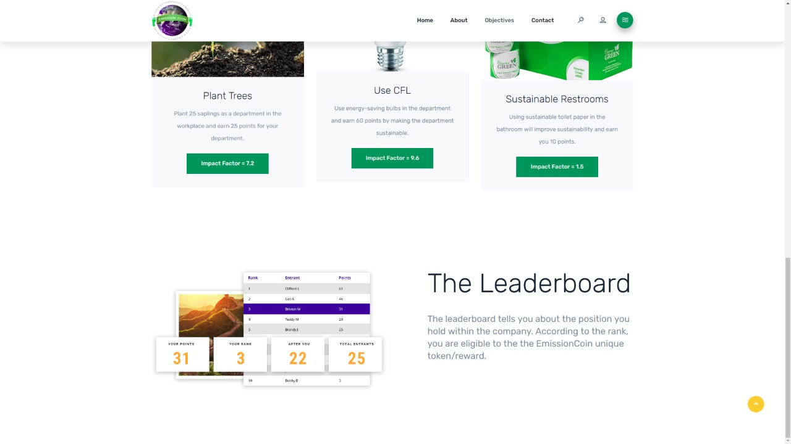

# Emissioncoin

## Problem:
  
According to the national wildlife foundation, if everyone in the world lived the way people lived in the US, it would take 5 earths to provide enough resources to everyone. Ozone depletion, rising temperature, melting ice caps, and rising ocean levels are primarily caused by industry and individual consumption of resources and emission of carbon. While increases in consumption and growth in industry benefit the world economically, these changes seem to exponentially damage our environment. The damage to the earth will soon outweigh the economic benefits of growth. 

## Solution:

We would like to think that with the understanding of the information above every person living in the world would fully commit to preserving our earth, but we also understand that this isn’t realistic. Even for those individuals and corporations that have realized change is necessary, it is hard to keep these issues in forefront of their minds and incorporate changes into their daily routines. To inspire individuals and corporations to be more green, we give them the easiest reason to decrease emissions and consumption of resources through a combination of social, financial, and interactive incentives in return for completing green objectives. 

## User Review:

 A company profile who we could work with in the beginning would be a company who is ready to implement green initiatives and already has been trying but it hasn’t been efficient in the workplace. Especially smaller, growing departments and then eventually we take on giants in the various industries in order to maximize revenue and increase eco-friendliness and sustainability. 

## Prototype:
The website can be found under the website folder and the HTML file is "service.html". Some of the screenshots can be found below:

## Technical Stack:

We offer a comprehensive dashboard tracks employee/department reduction of emissions for its company. Some features include a graph displaying that person's/department’s carbon footprint changes, a wallet that displays the quantity of ERC721 tokens and the rewards associated with each of those tokens, and a leaderboard that displays which departments/employees are winning the competition in a given competition period. We also offer a blockchain and AI  based technical system that tracks changes in carbon footprint determined by an impact factor associated with each green objective. Additionally, we have an immutable ledger that tracks all objectives completed with our company. This information can be used to determine eligibility for green standard certifications, subsidies, and can be used to calculate aggregate changes in emissions per company.  

## Possible interactive and fun objective list: 
### Objective List 
<li>
Ride-sharing using company transportation </li>
<li>Switching to use of bikes instead of cars to reduce emission</li>
<li>Replace lights in department floor and office space to Longtime LED/CFL bulbs </li>
<li>Implement usage of solar panels/ solar energy </li>
<li>Decrease in use of flights and other transportations for national, farther than local meetings and use skype/slack/zoom etc. video conferencing. </li>
<li>Implement thermostat rules for temperature regulations </li>
<li>Decrease the use of paper and plastic and more recyclable utensils/refrigerators/kitchen space</li>
 <li>Turn off desktops and high energy usage systems in the workspace </li>
<li>Light sensors to maintain a smaller energy bill </li>
<li>Maximize natural light possibly </li>
<li>Use more efficient supplies for cleaning and other purposes</li>
<li>Implement a bevi (water cooling system)</li>
<li>Decrease usage of plug-in ports </li>
<li>Implement greenery in your workspace </li>
<li>Implement organic snacks/food instead of harmful ones </li>
<li>Be efficient in the recycling system </li>
<li>Install wind turbines </li>
<li>Install timed water taps and advance your washrooms </li>
<li>Use of EV cars/ implementing new air filters </li>
<li>Install green roofs/ balconies/ green room with floor </li>

